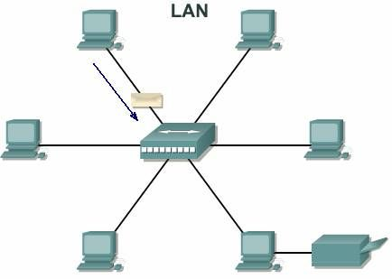
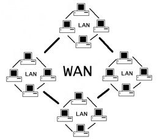
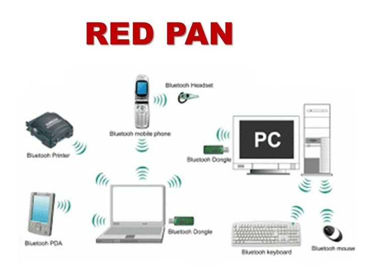
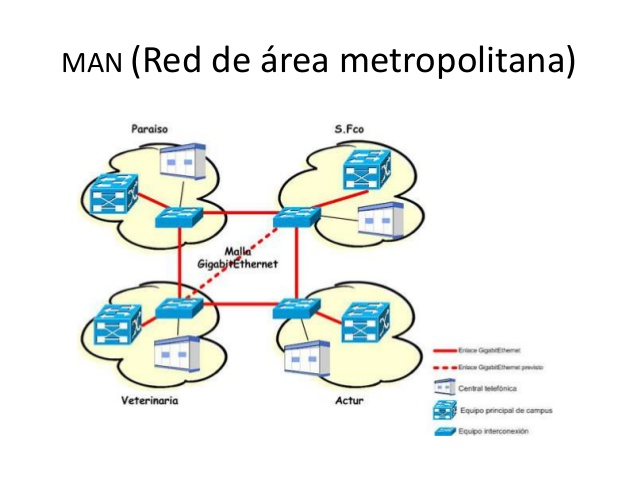
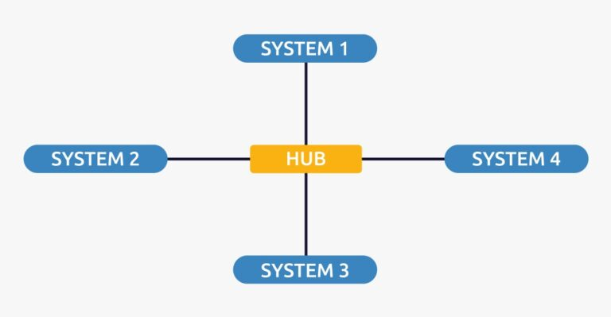
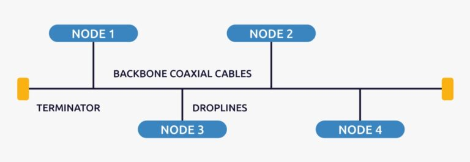
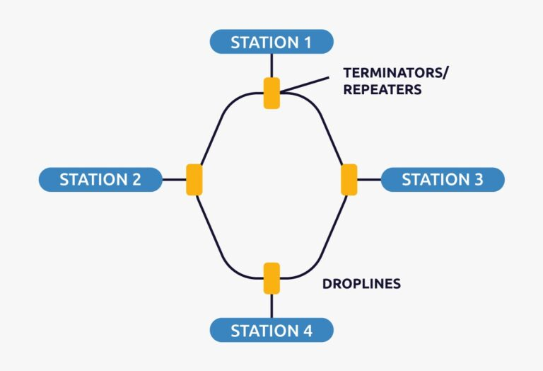
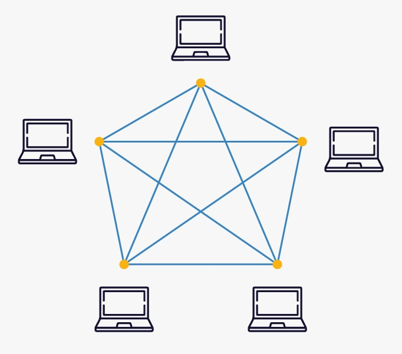
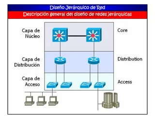
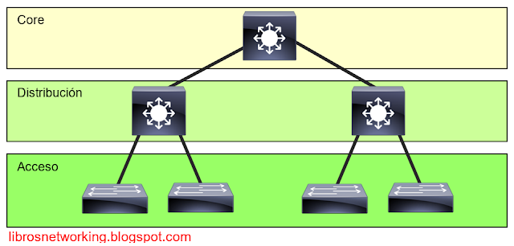

## Conceptos Generales de Infraestructura de Redes

En un mundo interconectado, las redes son la base para la comunicación entre dispositivos. Entender cómo funcionan y de qué están compuestas es esencial para cualquier profesional en el ámbito de las telecomunicaciones, TI o ciberseguridad.

---

## ¿Qué es una red y de qué está compuesta?

Una red es un conjunto de **dispositivos finales** interconectados que comparten información y recursos. Estos dispositivos utilizan **medios de transmisión** para comunicarse a través de **dispositivos intermedios**, como routers y switches, los cuales facilitan la conexión entre múltiples puntos.

### Componentes principales:

1. **Dispositivos finales**  
   Incluyen equipos como computadoras, teléfonos móviles, servidores y cámaras IP. Estos son los puntos donde la información se origina o se consume.

2. **Medios de transmisión**  
   Se refiere a los canales físicos o inalámbricos que transportan los datos. Ejemplos incluyen:
   - Cables de cobre (como UTP o coaxial).
   - Fibra óptica.
   - Enlaces inalámbricos (Wi-Fi, Bluetooth).

3. **Dispositivos intermedios**  
   Son responsables de conectar dispositivos finales y enrutar datos dentro de la red. Ejemplos:
   - **Switches**: Permiten la comunicación dentro de una red local.
   - **Routers**: Enrutan datos entre diferentes redes.
   - **Access Points**: Extienden redes inalámbricas.

4. **Protocolos de comunicación**  
   Los protocolos son estándares que aseguran que los datos se transmitan de forma efectiva. Algunos de los más comunes son:
   - **TCP/IP**: Base de la comunicación en Internet.
   - **UDP**: Protocolo orientado a la velocidad, utilizado en streaming.
   - **FTP**: Para transferencias de archivos.
   - **HTTPS**: Protocolo seguro para navegación web.

---

## Tipos de redes: Topologías a gran escala

Las redes se clasifican según su tamaño y alcance:

1. **LAN (Local Area Network)**  
   Redes locales utilizadas en hogares, oficinas o campus. Ofrecen alta velocidad y cobertura limitada.

   

2. **WAN (Wide Area Network)**  
   Conectan redes LAN a través de grandes distancias geográficas, como Internet.

     

3. **PAN (Personal Area Network)**  
   Redes personales de corto alcance, como Bluetooth o USB.

  

4. **MAN (Metropolitan Area Network)**  
   Redes que abarcan una ciudad o campus grande, típicamente administradas por una sola entidad.

---

## Topologías de redes LAN

Dentro de una LAN, existen varias configuraciones posibles:

1. **Topología en estrella**  
   Cada dispositivo está conectado a un dispositivo central (como un switch). Es fácil de administrar y diagnosticar fallos.

     

2. **Topología en bus**  
   Todos los dispositivos comparten un único medio de transmisión. Es económica pero menos fiable ante fallos.

      

3. **Topología en anillo**  
   Los dispositivos están conectados en un bucle cerrado. Los datos viajan en una dirección y dependen de cada nodo para llegar al destino.

      

4. **Topología malla**  
   Cada dispositivo está conectado directamente a varios otros. Es robusta pero costosa.

     

---

## Modelos jerárquicos en redes

Un diseño eficiente para redes grandes es el modelo jerárquico, compuesto por tres capas:

1. **Capa de acceso**  
   Donde se conectan los dispositivos finales.

2. **Capa de distribución**  
   Actúa como un punto intermedio para enrutar el tráfico entre la capa de acceso y la de núcleo.

3. **Capa de núcleo**  
   Diseñada para mover datos de manera rápida y confiable entre diferentes partes de la red.

      

### Núcleo colapsado  
En redes más pequeñas, se puede combinar la capa de núcleo y la de distribución en una sola, lo que se conoce como **núcleo colapsado**. Esto reduce costos y simplifica la administración.

   

---